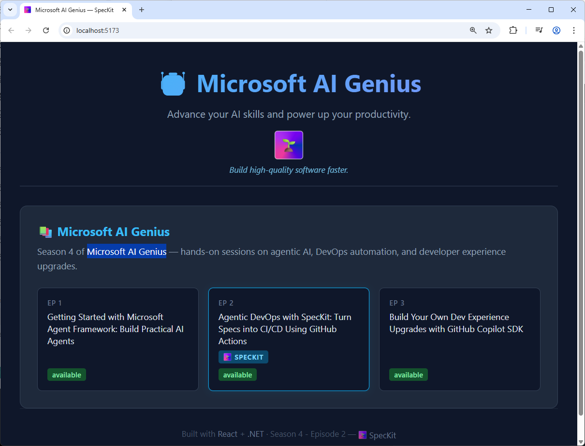
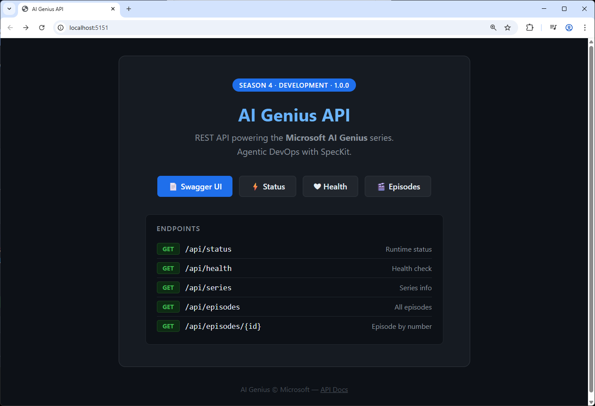

# Sample App: Spec-Driven App Development

## Building Features with Spec-Kit and GitHub Copilot

> **Hands-On Session: Spec-Driven Development using Spec-Kit and GitHub Copilot**
>
> This guide follows a live session agenda - from setting up Spec-Kit in the repo, to
> touring an existing spec, to building a brand-new feature in the frontend, then building
> the matching feature in the backend API with a second spec, and wrapping up with next steps.
> **Core message:** Specifications become the source of truth. Code is their expression.
> The working feature is the outcome.

**Best to fork the repo and create GitHub Actions in your own repo so that you can configure settings, variables and secrets.**

---

## 🗺️ Session Overview

| Part | Topic |
|------|-------|
| [Part 0 - The Demo Apps](#part-0---the-demo-apps) | Overview of the frontend and API apps |
| [Part 1 - Setup](#part-1---setup) | Set up Spec-Kit in the GitHub repo |
| [Part 2 - Explore an Existing Spec](#part-2---explore-an-existing-spec) | Tour a completed spec & its components |
| [Part 3 - Frontend App](#part-3---frontend-app) | Step-by-step: build a new feature in the React frontend |
| [Part 4 - API App](#part-4---api-app) | Speed run: build the matching backend feature with a second spec |
| [Part 5 - Text Search End-to-End](#part-5---text-search-end-to-end) | Speed run: wire the frontend to the API search endpoint |
| [Part 6 - Wrap-up](#part-6---wrap-up) | Wrap-up and next steps |

Refer to the `GitHub Actions Settings` section inside `AGENTS.md` to create GitHub repo variables and secrets.

---

## Part 0 - The Demo Apps

> **Agenda:** Overview of the frontend and API apps that will be extended during this session.

This session uses the **Sample App** demo — a full-stack web application consisting of two components:

### React Frontend (`src/app-web`)

A React 18 + Vite single-page application that displays episodes for a demo series. It fetches episode data from the backend API and renders them as interactive cards.



### .NET API Backend (`src/app-api`)

A .NET 9 minimal API that serves episode and series metadata. It exposes a set of REST endpoints consumed by the frontend and includes a built-in Swagger UI for exploration. Swagger endpoint `http://localhost:5151/swagger/index.html`.



| Endpoint | Description |
|----------|-------------|
| `GET /api/status` | Runtime status |
| `GET /api/health` | Health check |
| `GET /api/series` | Series info |
| `GET /api/episodes` | All episodes |
| `GET /api/episodes/{id}` | Episode by number |

In this session we use Spec-Kit to add a new feature end-to-end: a **search/filter capability** first in the frontend, then the supporting API endpoint in the backend.

---

## Part 1 - Setup

> **Agenda:** Set up Spec-Kit in the GitHub repo.

### 1.1 Prerequisites

Before starting, make sure you have:

- **GitHub Copilot** subscription (individual, Business, or Enterprise)
- **Python 3.8+** with `uv` (for installing Specify CLI)
- **Node.js 20+** and `npm`
- **.NET 9 SDK** (for the API)
- **Git** configured locally
- The repository cloned locally or opened in GitHub Codespaces

```bash
# Verify prerequisites
node --version   # >= 20
python --version # >= 3.8
dotnet --version # >= 9.0
git --version
```

Install `uv` if you don't have it:

```powershell
(for windows)
powershell -ExecutionPolicy ByPass -c "irm https://astral.sh/uv/install.ps1 | iex"

uv tool install specify-cli --from git+https://github.com/github/spec-kit.git@v0.8.3
```


```bash
(for linux)
curl -LsSf https://astral.sh/uv/install.sh | sh

uv tool install specify-cli --from git+https://github.com/github/spec-kit.git@v0.8.3
```

---

### 1.2 - Install Specify CLI

The `specify` CLI scaffolds the spec-kit file structure and installs the `/speckit.*`
slash commands into your AI agent. For GitHub Copilot, this writes prompt files into
`.github/copilot-instructions.md` and the `.github/` commands directory.

```bash
# Initialise spec-kit in the current directory for GitHub Copilot
specify init .

specify init . --ai copilot --script ps
```

### 1.3 Verify the installation

```bash
specify check
```

After initialisation, Copilot gains these slash commands in its context:

| Command | Purpose |
|---------|---------|
| `/speckit.constitution` | Define project governing principles |
| `/speckit.specify` | Describe what to build |
| `/speckit.clarify` | Resolve ambiguities in the spec |
| `/speckit.plan` | Create a technical implementation plan |
| `/speckit.tasks` | Generate an actionable task list |
| `/speckit.analyze` | Cross-artifact consistency check |
| `/speckit.checklist` | Validate spec completeness |
| `/speckit.implement` | Execute all tasks |

> **Context Awareness:** Spec-Kit commands automatically detect the active feature based
> on your current Git branch (e.g., `004-text-search`). Switch features by switching branches.

---

### 1.4 - Define Your Constitution

**In GitHub Copilot Chat**, use `/speckit.constitution` to establish the governing
principles for this project. The constitution is committed to `specs/constitution.md` and
guides every subsequent specification and implementation decision.

```
/speckit.constitution

This project is the Sample App web application. It consists of a .NET API backend (src/app-api) and a React frontend (src/app-web).

Core principles:
- User-first: features must work end-to-end from UI to API before being marked done.
- API-first: the frontend never assumes data shapes that the backend contract doesn't define.
- Simplicity: prefer standard libraries, avoid over-engineering.
- Testable: every new feature ships with at least one automated test.
- Demo Session: keep process simple, and use common practise.
```

Copilot will generate `specs/constitution.md` with your project's articles and principles. Review and commit it.

---

## Part 2 - Explore an Existing Spec

> **Agenda:** Tour a completed spec & its components before building a new one.

Before building anything new, orient yourself in an existing Spec-Kit feature that
already lives in `specs/001-bicep-deploy/`. Walking through it demonstrates
what a complete Spec-Kit feature looks like and shows the role of every artifact —
the same structure you'll use for the app features built in this session.

### 2.1 - Tour the Spec Folder

Open `specs/001-bicep-deploy/` and note each file's purpose:

| File | Role |
|------|------|
| `spec.md` | Business requirements - the **what** and **why** |
| `plan.md` | Technical implementation plan - the **how** |
| `research.md` | Library choices and rationale |
| `data-model.md` | Entities, attributes, and relationships |
| `contracts/workflow-interface.md` | Interface / API contract |
| `quickstart.md` | Key validation scenarios and smoke-test steps |
| `tasks.md` | Ordered, atomic task list derived from the plan |
| `checklists/requirements.md` | Spec completeness checklist |

Open `spec.md` and trace one requirement all the way through to `tasks.md` to see how Spec-Kit keeps every layer in sync.

### 2.2 - The Spec-Kit Flow

Every feature in this repo is built with the same command sequence:

```
/speckit.specify
/speckit.clarify
/speckit.plan
/speckit.tasks
/speckit.analyze
/speckit.checklist
/speckit.implement
```

We'll use this exact flow twice in this session: once for the frontend feature, once for the backend feature.

---

## Part 3 - Frontend App

> **Agenda:** Step-by-step walkthrough to build a new search/filter feature in the React frontend.

### 3.1 - Create the Spec

**In GitHub Copilot Chat**, use `/speckit.specify` to describe what you want to build.
Focus on the **what** and **why** - not the tech stack.

This first spec focuses on adding a **search and filter** experience to the React frontend so users can find episodes quickly.

Create a feature branch to work on the task by running below. Check the new feature branch.

```bash
/speckit.git.feature use feature name `text-search`
```

```bash
/speckit.git.commit setup feature branch
```

Spec-Kit will:
1. Automatically determine the next feature number (e.g., `004`)
2. Create a feature branch (`004-text-search`)
3. Generate `specs/004-text-search/spec.md` from the template

```
/speckit.specify

Add a search and filter feature to the Sample App React frontend in src/app-web.

- Users can type in a search box to filter episodes by title or description.
- Users can filter the visible episode list without reloading the page.
- The feature must work with the existing GET /api/episodes data already fetched by the app.
- No results found state must show a friendly message.
```

Watch the `GitHub Copilot` logs — it will take a few moments. While waiting, go to the `.specify/templates` folder to explore the template like `spec-template.md` and show what's there.

When `/speckit.specify` completes, inspect the generated spec file below:

```bash
cat specs/004-text-search/spec.md
cat specs/004-text-search/checklists/requirements.md
```

---

### 3.2 - Clarify the Spec

**In GitHub Copilot Chat**, use `/speckit.clarify` to resolve any ambiguities.
Run it once with a general focus, then again with specific concerns.

Use the `Clarify` button suggested by `GitHub Copilot` to continue the flow, answer follow-up questions (about 5 of them). For each Q/A, look at `spec.md` to review the incremental changes.

**First pass - general clarification:**

```
/speckit.clarify

The frontend is a React 18 + Vite app in `src/app-web`. Resolve all [NEEDS CLARIFICATION] markers in the spec.

- Filtering happens client-side against episodes already loaded from GET /api/episodes.
- The search box lives in the header, above the episode grid.
- Matching is case-insensitive and matches title or description.

Only ask 1-2 questions max if needed.
```

**Second pass - UX details (Optional):**

```
/speckit.clarify

Focus on UX and accessibility.
- The search input has a visible label and placeholder text.
- Results update as the user types (debounced), no submit button required.

Only ask 1-2 questions max if needed.
```

Review `specs/004-text-search/spec.md` after each clarify pass to confirm the `[NEEDS CLARIFICATION]` markers are resolved.

---

### 3.3 - Create a Technical Implementation Plan

**In GitHub Copilot Chat**, use `/speckit.plan` to provide the tech stack and architecture choices. Spec-Kit translates the business requirements into a detailed technical implementation plan.

```
/speckit.plan

One week sprint for a React 18 app built with Vite in `src/app-web`. Use component state (useState) for the search term, no new dependencies.
```

Spec-Kit generates into `specs/004-text-search/`:

| File | Contents |
|------|----------|
| `plan.md` | Full technical implementation plan |
| `data-model.md` | Data structures and component state |
| `contracts/` | Component/API contracts |
| `research.md` | Library choices and rationale |
| `quickstart.md` | Key validation scenarios |

The generation will take a while. While waiting, let's explore the models, prompts, and MCP servers for GitHub Copilot inside VS Code (about 5 minutes). Optionally show how to create a custom agent if needed to pass time.

---

### 3.4 - Generate Tasks

**In GitHub Copilot Chat**, use `/speckit.tasks` to generate an actionable task
list from the implementation plan. Tasks are derived from the contracts, data
model, and test scenarios.

```
/speckit.tasks
```

Spec-Kit reads `plan.md` and supporting documents to produce `specs/004-text-search/tasks.md` with:

- Tasks ordered by dependency
- Independent tasks marked `[P]` (safe to run in parallel)
- References to which contract or data-model entity each task implements

Review `specs/004-text-search/tasks.md` and adjust priorities if needed.

---

### 3.5 - Analyze and Validate

**In GitHub Copilot Chat**, use `/speckit.analyze` to run a cross-artifact consistency check. This catches mismatches between the spec, plan, contracts, and tasks before any code is written.

```
/speckit.analyze
```

Copilot will check:

- All UI behaviors in the spec are covered by tasks
- Data/state model referenced in the plan matches the contracts
- The implementation phases have prerequisites and deliverables
- No speculative or "might need" features crept in

Address any inconsistencies reported before proceeding.

---

### 3.6 - Validate the Spec (Optional)

**In GitHub Copilot Chat**, use `/speckit.checklist` to run a quality check on
the specification before moving to implementation. This acts like a
unit test for the English requirements.

```
/speckit.checklist
```

Copilot will report on:

- ✅ No `[NEEDS CLARIFICATION]` markers remaining
- ✅ All requirements are testable and unambiguous
- ✅ Success criteria are measurable
- ✅ Empty/no-results states are defined
- ✅ Accessibility requirements are specified

Address any failing checklist items before continuing.

---

### 3.7 - Implement

**In GitHub Copilot Chat**, use `/speckit.implement` to execute the task list and build the search feature in the frontend. It will take a few minutes to finish.

```
/speckit.implement 004-text-search
```

Copilot will update `src/app-web/src/App.jsx` (and related files) to add the search box and filtering logic. Review and commit the generated changes:

```bash
git add .
git commit -m "feat: add episode search to frontend"
```

---

### 3.8 - Run the Frontend Feature End-to-End

```bash
cd src/app-web
npm ci
npm run dev
```

#### Verify Success

1. Open the local dev server URL in your browser.
2. Type into the new search box and confirm the episode grid filters as you type.
3. Clear the search box and confirm all episodes reappear.
4. Search for a term with no matches and confirm the friendly empty state appears.

```
Expected:
✅ Search box is visible and labeled
✅ Episode grid filters live as you type
✅ No-results state renders a friendly message
```

If any step fails, check the browser console for errors and fix before proceeding.

---

## Part 4 - API App

> **Agenda:** Speed run to build the matching backend search endpoint with a second spec.

Use Spec-Kit with `GitHub Cloud Agent` or `GitHub Copilot + Autopilot` to create a spec for the backend search endpoint. The speed workflow runs all spec-kit commands: specify → clarify → plan → tasks → implement.

### 4.1 - Create the Backend Search Endpoint (via GitHub Copilot Coding Agent)

Go to GitHub.com and select the repo, go to the `Agent` tab to invoke an agent session. It takes about 15-20 minutes to run. Suggest launching this session at the start of the talk and leaving it running in the background.

```
Please run below steps one by one, and provide response automatically. Don't overthink, make sure each step finishes promptly!

Step 1:
/speckit.specify

Add a search endpoint to the Sample App backend API in `src/app-api`.

- New endpoint: GET /api/episodes/search?query={term}
- Matches episode title or description, case-insensitive.
- Returns the same episode shape as GET /api/episodes, filtered.
- Returns an empty array (not an error) when no episodes match.

Step 2:
/speckit.clarify

- The API runs on .NET 9 minimal APIs, same style as the existing endpoints in Program.cs.
- The query parameter is optional; omitting it returns all episodes (same as GET /api/episodes).
- Matching uses simple case-insensitive Contains(), no external search library.

Step 3:
/speckit.plan

Step 4:
/speckit.tasks

Step 5:
/speckit.analyze

Step 6:
/speckit.checklist

Step 7:
/speckit.implement
```

### 4.2 - Create the Backend Search Endpoint (via GitHub Copilot + Autopilot)

Use `Autopilot` to implement the endpoint end-to-end instead:

- Turn on `Autopilot` in VS Code
- Invoke the prompt from #4.1 in a separate VS Code window and run it locally
- Don't create a branch in the prompt so that it is isolated
- Checkout a second repo folder locally, so it won't conflict with Part 3

### 4.3 - Review and Verify

Check the logs and review the generated changes to `src/app-api/Program.cs`. We can check progress during the wait time of earlier demo steps.

```bash
cd src/app-api
dotnet run
```

Open `http://localhost:5151/swagger/index.html`, try the new `GET /api/episodes/search` endpoint, and confirm it returns filtered results.

---

## Part 5 - Text Search End-to-End

> **Agenda:** Speed run to connect the frontend search box to the backend search endpoint.

Use Spec-Kit with `GitHub Copilot CLI` to replace the client-side filtering from Part 3 with the server-side search endpoint built in Part 4.

### 5.1 - Create a Text Search Spec

In a separate checkout, create a local branch in VS Code, call it `004-text-search`, then open a terminal window inside VS Code and run `copilot`.

```
Please run below steps one by one, and provide response automatically. Don't overthink, make sure each step finishes promptly!

Step 1:
/speckit.specify

Connect the Sample App frontend search box to the backend text search endpoint.

- The React frontend in src/app-web calls GET /api/episodes/search?query={term} instead of filtering client-side.
- Requests are debounced so typing does not fire one request per keystroke.
- An empty search term returns all episodes.
- The no-results state and friendly message from Part 3 still work.

Step 2:
/speckit.clarify

- The API is the .NET minimal API in src/app-api, already exposing GET /api/episodes/search.
- The frontend uses fetch with the existing VITE_API_URL base URL, no new dependencies.
- Matching stays case-insensitive across title and description, handled by the API.

Step 3:
/speckit.plan

Step 4:
/speckit.tasks

Step 5:
/speckit.analyze

Step 6:
/speckit.checklist

Step 7:
/speckit.implement
```

### 5.2 - Review Logs

Check the logs and review changes. We can check the progress during the wait time of earlier demo steps.

---

## Part 6 - Wrap-up

> **Agenda:** Wrap-up and next steps.

### What We Built Today

We used Spec-Kit and GitHub Copilot to:

1. **Set up** the spec-kit scaffolding and project constitution.
2. **Understood** a complete, existing spec (`001-bicep-deploy`) by reading every artifact.
3. **Built** a frontend search feature step-by-step - specify → clarify → checklist → plan → tasks → analyze → implement.
4. **Speed-ran** the same workflow for the matching backend API endpoint.
5. **Connected** the frontend to the API so search runs server-side, all under the same `004-text-search` spec.

Every decision - from UX copy to matching rules to the search contract - lives in the spec. The code is just its expression.

### Explore Spec-Kit Further

**GitHub repository:** [github.com/github/spec-kit](https://github.com/github/spec-kit)

---

*Sample App · Spec-Kit App Development with GitHub Copilot*
