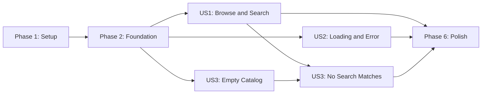

# Tasks: Sample App Episode Browser

**Input**: Design documents from `specs/002-web-app/`  
**Prerequisites**: `plan.md`, `spec.md`, `research.md`, `data-model.md`, `contracts/api-contract.yaml`, `quickstart.md`

**Tests**: Automated test tasks are not included because the specification does not request TDD and the dependency constraint permits only React, React DOM, and Vite. The production build and manual acceptance matrix remain required validation.

**Organization**: Tasks are grouped by user story so each story can be implemented and checked as a distinct increment.

## Format: `[ID] [P?] [Story] Description`

- **[P]**: Can run in parallel with adjacent work because it uses a different file and has no dependency on an incomplete task.
- **[Story]**: Maps implementation work to a user story in `spec.md`.
- Every task names the exact file or directory it changes or validates.

## Phase 1: Setup (Shared Infrastructure)

**Purpose**: Create the plugin-free React 18 and Vite project scaffold.

- [X] T001 Define the private package, Node `^20.19.0` engine, `dev`/`build`/`preview` scripts, React `18.3.1`, React DOM `18.3.1`, and Vite `8.2.1` in src/app-web/package.json
- [X] T002 [P] Create a minimal plugin-free Vite configuration in src/app-web/vite.config.js
- [X] T003 [P] Create the Sample App document shell with the `#root` mount element and `/src/main.jsx` module entry in src/app-web/index.html
- [X] T004 Generate and commit the reproducible npm lockfile from src/app-web/package.json into src/app-web/package-lock.json

**Checkpoint**: The frontend package can be installed reproducibly and has all required browser and build entry points.

---

## Phase 2: Foundational (Blocking Prerequisites)

**Purpose**: Establish the shared page shell, API boundary, state model, and React bootstrap required by every user story.

**CRITICAL**: Complete this phase before implementing any user story.

- [X] T005 [P] Define global design tokens, reset rules, base typography, focus treatment, and responsive page defaults in src/app-web/src/index.css
- [X] T006 Create the `App` shell with the persistent Sample App header, semantic main content region, and `loading`/`ready`/`error` remote-state discriminator in src/app-web/src/App.jsx
- [X] T007 Implement `VITE_API_URL` normalization, successful-response checks, contract shape validation, concurrent `/api/status` `/api/series` `/api/episodes` loading with `Promise.all`, healthy-status gating, and `AbortController` cleanup in src/app-web/src/App.jsx
- [X] T008 [P] Define shared `.app-shell`, `.site-header`, `.content-region`, and `.state-panel` layout styles in src/app-web/src/App.css
- [X] T009 Mount `App` with React 18 `createRoot` and `StrictMode`, importing the global stylesheet, in src/app-web/src/main.jsx

**Checkpoint**: The app starts one cancellable three-endpoint load, preserves its header, and reaches one non-contradictory remote state without implementing API endpoints.

---

## Phase 3: User Story 1 - Browse Series Episodes (Priority: P1) - MVP

**Goal**: Display the featured series and every loaded episode, then let visitors filter cards locally by title or presenter.

**Independent Test**: With valid contract responses, open the app once and confirm the header, series information, and one card per episode appear; enter mixed-case title and presenter terms and confirm visible cards update in place without another request or page reload.

### Implementation for User Story 1

- [X] T010 [US1] Render the ready-state series section and semantic episode list with stable season/episode keys plus `Unavailable` fallbacks for blank title, presenter, or status values in src/app-web/src/App.jsx
- [X] T011 [US1] Add a controlled `searchTerm` with `useState` and derive trimmed case-insensitive title/presenter matches during render without storing filtered data or issuing another request in src/app-web/src/App.jsx
- [X] T012 [P] [US1] Style the `.series-panel`, `.search-control`, `.episode-grid`, `.episode-card`, and status presentation for scannable desktop and mobile layouts in src/app-web/src/App.css

**Checkpoint**: User Story 1 is independently usable as the MVP against valid API responses.

---

## Phase 4: User Story 2 - Understand Service Failure (Priority: P2)

**Goal**: Keep the page understandable while requests are pending or the required service data cannot be loaded.

**Independent Test**: Delay the three requests and then make each endpoint unreachable or unhealthy in turn; confirm the persistent header accompanies a friendly loading state followed by a friendly error with no partial cards or raw exception text.

### Implementation for User Story 2

- [X] T013 [US2] Render accessible loading feedback with `aria-busy` and a polite status announcement, plus a generic `role="alert"` error state that suppresses partial content and raw failures, in src/app-web/src/App.jsx
- [X] T014 [P] [US2] Style `.state-panel--loading` and `.state-panel--error` for clear readable feedback without resizing or overlapping the persistent shell in src/app-web/src/App.css

**Checkpoint**: User Story 2 can be verified independently with delayed, failed, malformed, or unhealthy service responses.

---

## Phase 5: User Story 3 - Recognize an Empty Catalog (Priority: P3)

**Goal**: Distinguish a valid empty catalog and a search with no matches from a service failure.

**Independent Test**: Return a valid empty `episodes` array and confirm the series plus catalog-empty message appear; with loaded episodes, enter an unmatched term and confirm the search-specific message appears and clearing the term restores all cards.

### Implementation for User Story 3

- [X] T015 [US3] Render distinct polite live-region messages for an empty API catalog and for no title/presenter search matches while preserving the series section and editable search control in src/app-web/src/App.jsx
- [X] T016 [P] [US3] Style `.empty-state` and `.no-match-state` as friendly content states distinct from `.state-panel--error` in src/app-web/src/App.css

**Checkpoint**: User Story 3 correctly differentiates empty and no-match outcomes from unavailable service data.

---

## Phase 6: Polish & Cross-Cutting Concerns

**Purpose**: Validate the integrated one-page experience across all stories and repository constraints.

- [X] T017 Audit and correct semantic headings, visible search labeling, keyboard focus, live announcements, mobile layout, and 200% zoom behavior across src/app-web/src/App.jsx, src/app-web/src/App.css, and src/app-web/src/index.css
- [X] T018 Run `npm ci` and `npm run build`, confirm the generated production bundle succeeds, and verify only React, React DOM, and Vite are declared in src/app-web/package.json and src/app-web/package-lock.json
- [X] T019 Execute every success, loading, endpoint failure, unhealthy status, invalid payload, empty catalog, missing-value, search, cancellation, configuration, and accessibility scenario documented in specs/002-web-app/quickstart.md

**Checkpoint**: The production build is clean and the complete acceptance matrix passes without adding API or infrastructure implementation.

---

## Dependencies & Execution Order

### Phase Dependencies

- **Phase 1 - Setup**: No dependencies; begin immediately.
- **Phase 2 - Foundational**: Depends on Phase 1 and blocks every user story.
- **Phase 3 - User Story 1**: Depends on Phase 2 and is the suggested MVP.
- **Phase 4 - User Story 2**: Depends only on Phase 2 logically and may be developed alongside User Story 1 with explicit coordination around shared files.
- **Phase 5 - User Story 3**: Its empty-catalog path depends only on Phase 2; full no-search-match acceptance depends on User Story 1 search behavior.
- **Phase 6 - Polish**: Depends on every story selected for release.

### User Story Dependency Graph

### Within Each User Story

- Implement behavior in `App.jsx` before integrating the story with later stories.
- Story CSS marked `[P]` may be authored concurrently because the required selectors are fixed in the task description.
- Validate the story at its checkpoint before proceeding to the next priority.
- User Story 1 and User Story 2 are logically independent after Phase 2, but both edit `App.jsx` and `App.css`; serialize those edits or assign explicit file ownership to avoid merge conflicts.

### Parallel Opportunities

- T002 and T003 can run alongside T001 because each creates a different scaffold file.
- T005 and T008 can run alongside the JavaScript foundation stream because they target separate stylesheet files with named selectors.
- T012 can run alongside T010-T011, T014 alongside T013, and T016 alongside T015 when the CSS and JSX workstreams use the selectors specified above.
- Cross-story work can proceed concurrently only with coordination because all three stories converge on `App.jsx` and `App.css`.

---

## Parallel Examples

### User Story 1

After Phase 2, run one stream for T010 then T011 in `src/app-web/src/App.jsx`, while a second stream completes T012 in `src/app-web/src/App.css`.

### User Story 2

After Phase 2, run T013 in `src/app-web/src/App.jsx` and T014 in `src/app-web/src/App.css` concurrently, then review the combined loading and error states.

### User Story 3

After Phase 2 and the User Story 1 search control, run T015 in `src/app-web/src/App.jsx` and T016 in `src/app-web/src/App.css` concurrently, then verify both empty outcomes.

---

## Implementation Strategy

### MVP First

1. Complete Phase 1 to create the deterministic Vite scaffold.
2. Complete Phase 2 to establish the shared data boundary and page shell.
3. Complete Phase 3 to deliver series browsing, episode cards, and local search.
4. Stop and validate User Story 1 against valid API responses.
5. Demo the MVP before adding secondary states.

### Incremental Delivery

1. **Foundation**: Setup plus shared API loading and React shell.
2. **MVP**: User Story 1 adds the complete successful browsing and search journey.
3. **Resilience**: User Story 2 adds understandable loading and service-failure behavior.
4. **Completeness**: User Story 3 adds valid empty-catalog and no-match outcomes.
5. **Release candidate**: Polish verifies the build, accessibility, responsiveness, and full manual matrix.

### One-Week Execution

- **Day 1**: T001-T009 scaffold and foundation.
- **Day 2**: T010-T011 data presentation and search behavior.
- **Day 3**: T012-T014 successful-state styling plus loading/error behavior.
- **Day 4**: T015-T017 empty states and accessibility/responsive review.
- **Day 5**: T018-T019 clean build and acceptance validation.

## Notes

- `[P]` means different files and no dependency on unfinished implementation when the named selectors and contracts are followed.
- `[US1]`, `[US2]`, and `[US3]` provide direct traceability to `spec.md`.
- Do not add `@vitejs/plugin-react`, a test framework, routing, API implementation, infrastructure, or any dependency beyond `react`, `react-dom`, and `vite`.
- Keep `searchTerm` as the only search state; visible episodes remain derived data.
- Commit after each task or small logical group and stop at any checkpoint for independent validation.